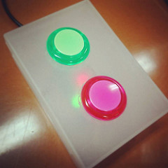

mqtt_button.ino
====

Publish states of buttons using MQTT protocol. 
This sketch is for ESP8266 boards.

Copyright and license
----
Copyright (c) 2016 yoggy

Released under the [MIT license](LICENSE.txt)